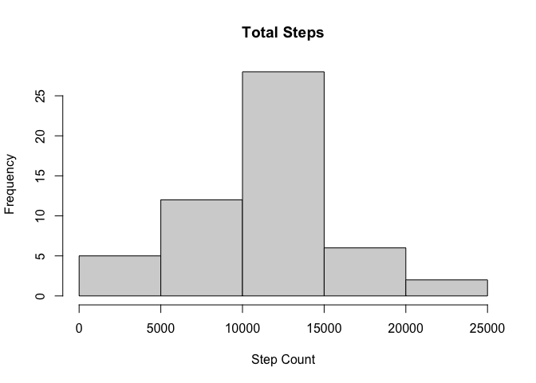
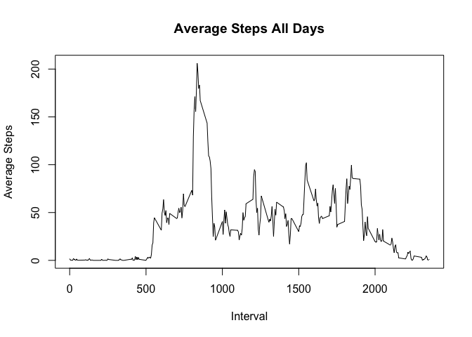
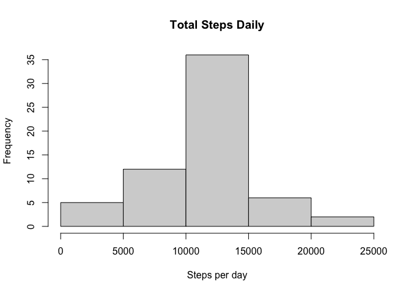
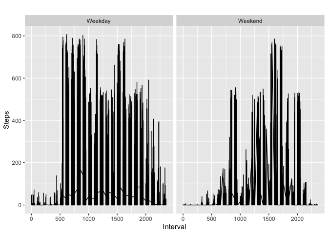

# Introduction

It is now possible to collect a large amount of data about personal movement using activity monitoring devices such as a Fitbit, Nike Fuelband, or Jawbone Up. These type of devices are part of the “quantified self” movement – a group of enthusiasts who take measurements about themselves regularly to improve their health, to find patterns in their behavior, or because they are tech geeks. But these data remain under-utilized both because the raw data are hard to obtain and there is a lack of statistical methods and software for processing and interpreting the data.

This assignment makes use of data from a personal activity monitoring device. This device collects data at 5 minute intervals through out the day. The data consists of two months of data from an anonymous individual collected during the months of October and November, 2012 and include the number of steps taken in 5 minute intervals each day.


## Mean Total Number of Steps Taken per Day

This section computes the total number of steps taken per day and the summary statistics for the total number of steps per day. 


```r
activity <- read.csv("activity.csv")

stepCount <- aggregate(activity$steps ~ activity$date, activity, sum)

colnames(stepCount) <- c("Date", "Total Steps")

hist(stepCount$`Total Steps`, main = "Total Steps", xlab = "Step Count")
```

<!-- -->

```r
summary(stepCount)
```

```
##      Date            Total Steps   
##  Length:53          Min.   :   41  
##  Class :character   1st Qu.: 8841  
##  Mode  :character   Median :10765  
##                     Mean   :10766  
##                     3rd Qu.:13294  
##                     Max.   :21194
```

The mean number of steps taken per day is 10766 and the median is 10765.

## Average Daily Activity Pattern

This section constructs a time series plot of the 5-minute interval and the average numner of steps taken, averaged across all days.


```r
stepsInterval <- aggregate(steps ~ interval, activity, mean)

plot(stepsInterval$interval, stepsInterval$steps, type = "l", main = "Average Steps All Days", xlab = "Interval", ylab = "Average Steps") 
```

<!-- -->

```r
max_steps <- which.max(stepsInterval$steps)
stepsInterval[max_steps, ]
```

```
##     interval    steps
## 104      835 206.1698
```

Interval 835 contains the maximum number of steps on average across all days in the dataset. 

## Imputing Missing Values

This section imputes the missing values in the dataset by replacing NA values with the mean value of steps for that 5-minute interval.


```r
sum(is.na(activity))
```

```
## [1] 2304
```

```r
activityNA <- activity

for(i in 1:nrow(activityNA))      {
        if(is.na(activityNA$steps[i]))  {
                    intervalValue <- activityNA$interval[i]
                    stepsValue <- stepsInterval[stepsInterval$interval == intervalValue, ]
                    activityNA$steps[i] <- stepsValue$steps
        }
}


noNAData <- activityNA

stepsDaily <- aggregate(steps ~ date, noNAData, sum)

hist(stepsDaily$steps, main = "Total Steps Daily", xlab = "Steps per day")
```

<!-- -->

```r
mean(stepsDaily$steps)
```

```
## [1] 10766.19
```

```r
median(stepsDaily$steps)
```

```
## [1] 10766.19
```

```r
mean(stepCount$`Total Steps`)
```

```
## [1] 10766.19
```

```r
median(stepCount$`Total Steps`)
```

```
## [1] 10765
```

The mean values remain the same but there is an increase in the median value when the missing values are imputed.

## Differences in Activity Patterns between Weekdays and Weekends

This section plots a time series graph of how the average number of steps taken varies across the time intervals for weekdays and weekends.


```r
noNAData$day <- weekdays(as.Date(noNAData$date))

for (i in 1:nrow(noNAData)) {
        if(noNAData$day[i] == c("Saturday", "Sunday"))
                noNAData$day[i] <- "Weekend"
}

for(i in 1:nrow(noNAData))  {
        if(noNAData$day[i] != c("Weekend"))
                noNAData$day[i] <- "Weekday"
}

noNAData$day <- as.factor(noNAData$day)

stepsDayType <- aggregate(steps ~ interval + day, noNAData, mean)

library(ggplot2)

ggplot(data = noNAData, aes(fill = day, y = steps, x = interval)) + geom_line() + facet_wrap(~day) + ggtitle("") + labs(x = "Interval", y = "Steps")
```

<!-- -->

It is apparent that on weekdays, most activity occurs in the earlier hours of the day, and on weekends most activity occurs in the second half of the day. 


